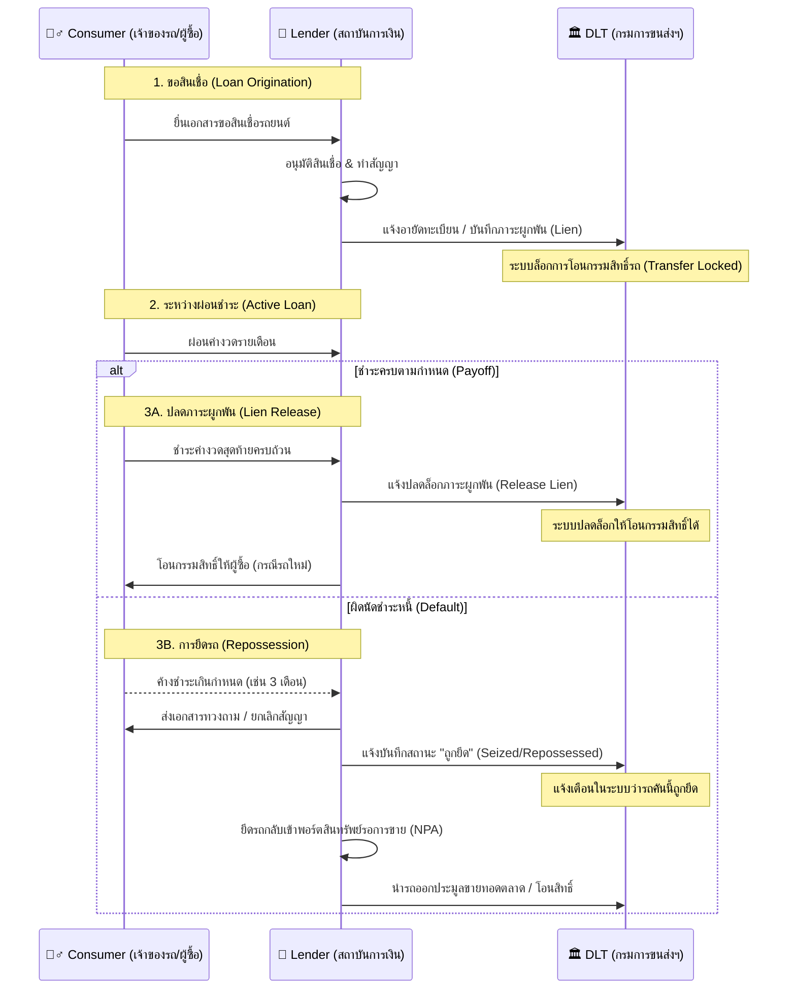

# Workflow การทำงานของ Lender (สถาบันการเงิน)

บทบาทหลักของ Lender คือการเป็นผู้ให้สินเชื่อรถยนต์ ไม่ว่าจะเป็นการจัดไฟแนนซ์รถใหม่/รถมือสอง หรือการนำเล่มทะเบียนมาขอสินเชื่อ (จำนำทะเบียน) ในระบบนิเวศรถยนต์บน Blockchain กระบวนการตั้งแต่อนุมัติสินเชื่อไปจนถึงการสิ้นสุดสัญญาจะถูกจัดการอย่างโปร่งใส ปลอดภัย และมีผลผูกพันทางกฎหมาย

---

## 🌊 ภาพรวม Workflow

---

## 📝 อธิบายขั้นตอนแบบเจาะลึก (Step-by-Step)

### Phase 1: การเกิดสัญญาและผูกมัด (Creation & Lock)
1. **ขอสินเชื่อ:** ผู้ประสงค์จะซื้อรถหรือเจ้าของรถ ยื่นขอสินเชื่อกับ Lender ผ่านตัวแทนจำหน่าย (Dealer) หรือยื่นโดยตรง
2. **อนุมัติและสร้างสัญญา:** เมื่อ Lender อนุมัติสินเชื่อ จะมีการทำสัญญาเช่าซื้อ (Hire-Purchase) หรือสัญญาเงินกู้
3. **กำหนดภาระผูกพัน (Create Lien):** Lender จะบันทึกสถานะ "ติดไฟแนนซ์" ลงในประวัติของรถคันนั้น 
4. **ล็อกการทำธุรกรรม:** ทันทีที่รถติด Lien ระบบของกรมการขนส่ง (DLT) จะรับทราบและ **ล็อกไม่ให้ทำการซื้อ-ขาย-โอนเปลี่ยนมือผู้ครอบครองได้เด็ดขาด** (Transfer Locked) จนกว่า Lender จะเป็นผู้มากดปลดล็อกเอง

### Phase 2: ช่วงเวลาผ่อนชำระ (Ongoing Monitoring)
1. **สถานะปกติ (Active):** ผู้ครอบครองรถผ่อนชำระค่างวดตามปกติ รถสามารถใช้งานได้ ต่อภาษีได้ ต่อ พ.ร.บ. และทำประกันภัยได้ตามปกติ แต่ไม่สามารถขายต่อ โอนสิทธิ์ หรือจำนำซ้อนได้
2. **การโอนสิทธิ์ระหว่างผ่อน (เปลี่ยนสัญญา):** หากผู้ครอบครองต้องการขายดาวน์หรือเปลี่ยนคนผ่อนต่อ ต้องแจ้ง Lender เพื่อทำการประเมินสินเชื่อคนใหม่ หากผ่านเงื่อนไข Lender จะเป็นผู้ทำรายการเปลี่ยนชื่อผู้ครอบครองในระบบให้เองโดยที่สถานะล็อกยึด (Lien) ยังคงอยู่

### Phase 3: การสิ้นสุดสัญญา (Termination)
จะแบ่งออกเป็น 2 กรณีหลักๆ คือ:

**กรณีที่ 3A: ชำระหนี้เสร็จสิ้น (Happy Path)**
1. ผู้ครอบครองจ่ายค่างวดครบตามกำหนด
2. Lender ทำการ **ปลดภาระผูกพัน (Lien Released)** ออกจากระบบ
3. สถานะการล็อกโอนรถจะถูกปลดออก (Unlocked)
4. Lender ทำเรื่องโอนกรรมสิทธิ์จดบัญชีจากชื่อของบริษัทไฟแนนซ์ ไปเป็นชื่อของผู้ครอบครองโดยสมบูรณ์ (หรือหากเป็นการจำนำเล่ม ก็คือการคืนสิทธิ์ขาดและโอนกรรมสิทธิ์กลับให้เจ้าของรถ)

**กรณีที่ 3B: ผิดนัดชำระหนี้และยึดทรัพย์ (Default & Repossession)**
1. ผู้ครอบครองขาดส่งค่างวดจนผิดเงื่อนไขสัญญา (เช่น ค้างชำระติดต่อกัน 3 งวด + หนังสือบอกกล่าว 1 เดือน)
2. Lender ยกเลิกสัญญาและส่งทีมหรือตัวแทนไป **ยึดรถ (Repossession)** กลับคืนมา
3. Lender จะอัปเดตสถานะรถคันนั้นในระบบเป็น **SEIZED (ถูกยึด/อายัด)** เพื่อให้ระบบรับรู้ว่ารถคันนี้กำลังเข้าสู่กระบวนการทางกฎหมายหรือกำลังรอขายทอดตลาด
4. เมื่อ Lender นำรถไปประมูลขายทอดตลาดเสร็จสิ้น Lender จะปลดสถานะ SEIZED ออก และโอนสิทธิ์รถไปให้ผู้ชนะการประมูล (เช่น ลานประมูล ผู้ซื้อรายใหม่ หรือเต็นท์รถมือสอง) ต่อไป

---

## 💡 ประโยชน์ที่ Lender จะได้รับจาก Smart Workflow นี้
* **ระงับการฉ้อฉลและการโอนเถื่อน:** ตราบใดที่ Lender ไม่ปลด Lien รถคันนั้นจะไม่สามารถแอบนำไปโอนเปลี่ยนชื่อที่กรมการขนส่งได้เลย รถถูกผูกมัดทางดิจิทัล 100%
* **ความโปร่งใสของมูลค่ารถ (Valuation Transparency):** หากรถเกิดอุบัติเหตุหนัก (Major Accident) หรือมีประวัติน้ำท่วม Lender จะสามารถเช็กประวัติความเสียหายได้ทันทีบน Blockchain ทำให้ประเมินมูลค่ารถเวลารับจัดไฟแนนซ์มือสองได้อย่างแม่นยำ
* **กระบวนการยึดรถที่ชัดเจนแจ้งเตือนระบบนิเวศน์:** เมื่อกดสถานะ "ถูกยึด (Seized)" ผู้ที่มีส่วนเกี่ยวข้องในระบบสาธารณะ (อย่างเช่น ลานประมูล ประกันภัย เจ้าหน้าที่ตรวจสภาพรถ หรือเต็นท์รถ) จะรู้สถานะที่แท้จริงของรถคันนี้ทันที ลดปัญหาความสับสนหรือข้อพิพาทความเป็นเจ้าของ
