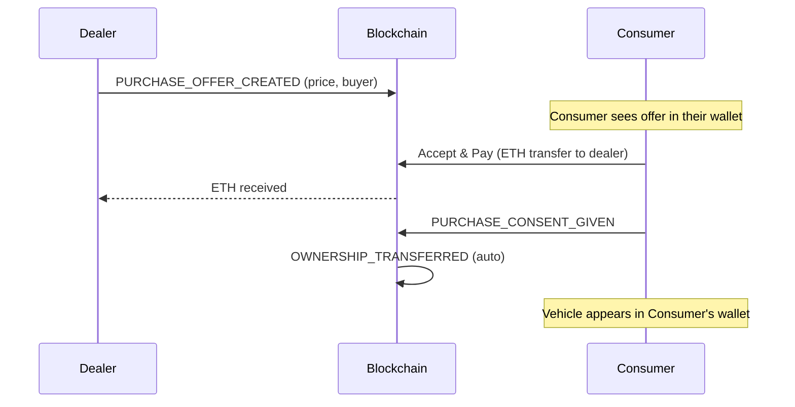

# Dealer → Consumer Sale with ETH Payment & Consent

ปรับ flow การขายรถจาก Dealer → Consumer ให้:
1. Dealer กรอกราคาเป็น ETH + wallet address ของ consumer
2. สร้าง **Purchase Offer** (ยังไม่โอน ownership)
3. Consumer เห็น offer ใน ConsumerPage → กด **Accept & Pay** → ETH ถูกโอนจาก consumer wallet → dealer wallet
4. หลังจ่ายเงินสำเร็จ → ownership transfer อัตโนมัติ

## Proposed Changes

### Types
#### [MODIFY] [vehicle.ts](file:///c:/Programming-Workspace/Kmutnb/Blockchain/Blockchain_VIN/Blockchain-Web/frontend/src/types/vehicle.ts)
- Add `PURCHASE_OFFER_CREATED` and `PURCHASE_CONSENT_GIVEN` to [EventType](file:///c:/Programming-Workspace/Kmutnb/Blockchain/Blockchain_VIN/Blockchain-Web/frontend/src/types/vehicle.ts#98-135)
- Add `pendingPurchase` optional field to [VehicleNFT](file:///c:/Programming-Workspace/Kmutnb/Blockchain/Blockchain_VIN/Blockchain-Web/frontend/src/types/vehicle.ts#74-97) to track pending offers

---

### Dealer Page
#### [MODIFY] [DealerPage.tsx](file:///c:/Programming-Workspace/Kmutnb/Blockchain/Blockchain_VIN/Blockchain-Web/frontend/src/pages/DealerPage.tsx)
- Replace [handleSellToCustomer](file:///c:/Programming-Workspace/Kmutnb/Blockchain/Blockchain_VIN/Blockchain-Web/frontend/src/pages/DealerPage.tsx#23-69) with a **Sale Modal** (not `prompt()`)
- Modal has: buyer wallet address, price in ETH
- On submit: creates `PURCHASE_OFFER_CREATED` event (does NOT transfer ownership yet)
- Shows "Pending Buyer Consent" badge on vehicles with active offers

---

### Consumer Page
#### [MODIFY] [ConsumerPage.tsx](file:///c:/Programming-Workspace/Kmutnb/Blockchain/Blockchain_VIN/Blockchain-Web/frontend/src/pages/ConsumerPage.tsx)
- Add a new **"Pending Purchase Offers"** section at the top
- Shows offers where `payload.buyer` matches the consumer's address
- Each offer card shows: vehicle info, price in ETH, dealer address
- **Accept & Pay** button: sends ETH via `wallet.sendTransaction()`, then fires `PURCHASE_CONSENT_GIVEN` event → triggers `OWNERSHIP_TRANSFERRED`

---

### Store
#### [MODIFY] [index.tsx](file:///c:/Programming-Workspace/Kmutnb/Blockchain/Blockchain_VIN/Blockchain-Web/frontend/src/store/index.tsx)
- Add `PURCHASE_OFFER_CREATED` handler in [applyEventToState](file:///c:/Programming-Workspace/Kmutnb/Blockchain/Blockchain_VIN/Blockchain-Web/frontend/src/store/index.tsx#22-229) → sets `pendingPurchase` on vehicle
- Add `PURCHASE_CONSENT_GIVEN` handler → clears `pendingPurchase` (ownership transferred separately)

---

### Blockchain Service
#### [MODIFY] [blockchain.ts](file:///c:/Programming-Workspace/Kmutnb/Blockchain/Blockchain_VIN/Blockchain-Web/frontend/src/services/blockchain.ts)
- Add `sendPayment(fromWallet, toAddress, amountEth)` method for direct ETH transfer
- This is a native ETH transfer (no smart contract needed), using `wallet.sendTransaction()`

---

## Flow Summary

## Verification Plan

### Manual Verification
1. Start Ganache + deploy contracts + start frontend (`npm run dev`)
2. Login as **DEALER** → see vehicle in inventory → click "Process Sale"
3. Modal appears → enter consumer wallet address + price (e.g. 0.5 ETH) → submit
4. Vehicle shows "Pending Consent" badge, sale is NOT completed
5. Login as **CONSUMER** → see pending offer section at top
6. Click **Accept & Pay** → confirm ETH payment → transaction processes
7. Vehicle now appears in Consumer's asset wallet, removed from Dealer's inventory
8. Check Ganache → ETH balance decreased for consumer, increased for dealer
