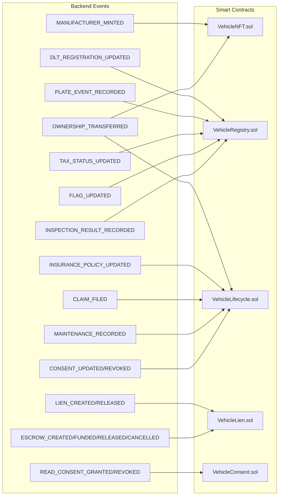

# ⛓️ Smart Contract Use Case Alignment Report

> วิเคราะห์ว่า Use Cases ใน [UseCase_SmartContracts.md](file:///c:/Users/ariya/OneDrive/%E0%B9%80%E0%B8%94%E0%B8%AA%E0%B8%81%E0%B9%8C%E0%B8%97%E0%B9%87%E0%B8%AD%E0%B8%9B/UseCase_SmartContracts.md) ตรงกับการ implement จริงใน codebase หรือไม่

## สรุปภาพรวม

| สถานะ | จำนวน |
|--------|--------|
| ✅ ตรงกัน (Fully Aligned) | **24** |
| ⚠️ ตรงบางส่วน (Partial) | **5** |
| ❌ ยังไม่มี (Not Implemented) | **3** |

---

## ✅ Use Cases ที่ตรงกัน (24/32)

| ID | Use Case | Contract Function | Backend Event | หมายเหตุ |
|---|----------|------------------|---------------|----------|
| A-01 | จัดการ Role | `AccessControl.grantRole/revokeRole` | [ensureRoles()](../backend/src/blockchain/blockchain.service.ts#144-185) ใน [blockchain.service.ts](../backend/src/blockchain/blockchain.service.ts) | ใช้ OpenZeppelin AccessControl ทุก contract |
| M-01 | Mint Vehicle NFT | `VehicleNFT.mintVehicle()` | `MANUFACTURER_MINTED` | ✅ สมบูรณ์ — ส่ง vinHash, modelHash, specHash |
| C-04 | Grant Write Consent | `VehicleLifecycle.grantWriteConsent()` | `CONSENT_UPDATED` | ✅ ส่ง scopeMask, expiresAt, nonce |
| C-05 | Revoke Write Consent | `VehicleLifecycle.revokeWriteConsent()` | `CONSENT_REVOKED` | ✅ ลบ consent record |
| DLT-01 | จดทะเบียนรถ | `VehicleRegistry.registerVehicle()` | `DLT_REGISTRATION_UPDATED` | ✅ ส่ง greenBookNoHash, docHash |
| DLT-02 | เปลี่ยนสถานะทะเบียน | `VehicleRegistry.setRegistrationStatus()` | — | ✅ ฟังก์ชันอยู่ใน contract (RegStatus enum) |
| DLT-03 | บันทึกป้ายทะเบียน | `VehicleRegistry.recordPlateEvent()` | `PLATE_EVENT_RECORDED` | ✅ ส่ง plateNoHash, provinceCode, eventType |
| DLT-06 | บันทึกการชำระภาษี | `VehicleRegistry.recordTaxPayment()` | `TAX_STATUS_UPDATED` | ✅ ส่ง taxYear, validUntil, receiptHash |
| DLT-07 | ตั้ง/ปลด Flag | `VehicleRegistry.setFlag()` | `FLAG_UPDATED` | ✅ ส่ง flagBit, active, refHash + Auto lock/unlock |
| DLT-12 | ล็อก/ปลดล็อกการโอน | `VehicleNFT.setTransferLock()` | (auto จาก setFlag/createLien) | ✅ Auto-lock เมื่อ Stolen/Seized/TotalLoss |
| F-01 | สร้าง Lien | `VehicleLien.createLien()` | `LIEN_CREATED` | ✅ ล็อก transferLock + บันทึก loanContractHash |
| F-02 | ปลด Lien | `VehicleLien.releaseLien()` | `LIEN_RELEASED` | ✅ ปลดล็อก + เปลี่ยนสถานะ Released |
| F-03 | ตั้งสถานะ Default | `VehicleLien.markDefault()` | — | ✅ ฟังก์ชันอยู่ใน contract (LienStatus.Defaulted) |
| C-08 | สร้าง Escrow | `VehicleLien.createEscrow()` | `ESCROW_CREATED` | ✅ ส่ง escrowId, buyer, conditionsMask |
| C-09 | วางเงิน Escrow | `VehicleLien.fundEscrowNative/ERC20()` | `ESCROW_FUNDED` | ✅ รองรับทั้ง native coin และ ERC-20 |
| C-10 | ยกเลิก Escrow | `VehicleLien.cancelEscrow()` | `ESCROW_CANCELLED` | ✅ คืนเงินผู้ซื้อ |
| C-11 | Fulfill Escrow | `VehicleLien.fulfillCondition()` | `ESCROW_RELEASED` | ✅ Auto-release เมื่อครบ conditions |
| I-01 | บันทึกกรมธรรม์ | `VehicleLifecycle.recordInsurancePolicy()` | `INSURANCE_POLICY_UPDATED` | ✅ ส่ง policyNoHash, action, validFrom/To |
| I-05 | เปิดเคลม | `VehicleLifecycle.fileClaim()` | `CLAIM_FILED` | ✅ ส่ง claimNoHash, evidenceHashes, severity |
| I-06 | อัปเดตสถานะเคลม | `VehicleLifecycle.updateClaimStatus()` | `INSURER_APPROVED_ESTIMATE` | ✅ อัปเดต ClaimStatus |
| S-01 | บันทึกประวัติซ่อม | `VehicleLifecycle.logMaintenance()` | `MAINTENANCE_RECORDED` | ✅ ตรวจ consent + ส่ง mileageKm, maintenanceHash |
| S-04 | บันทึกเลขไมล์ | (ผ่าน `logMaintenance` + DB) | `ODOMETER_SNAPSHOT` | ✅ มี monotonic check ป้องกันไมล์ถอยหลัง |
| INS-01 | บันทึกผลตรวจสภาพ | `VehicleRegistry.recordInspection()` | `INSPECTION_RESULT_RECORDED` | ✅ ส่ง result (pass/fail), metricsHash, certHash |
| D-04 | บันทึก Disclosure | `VehicleLifecycle.recordDisclosure()` | `DISCLOSURE_SIGNED` | ✅ ฟังก์ชัน contract + backend event มี |

---

## ⚠️ Use Cases ที่ตรงบางส่วน (5/32)

| ID | Use Case | สิ่งที่มี | สิ่งที่ขาด |
|---|----------|----------|-----------|
| A-02 | กำหนดค่าพารามิเตอร์ | มี `setInspectionMaxAge()` ใน `VehicleRegistry` | Backend ยังไม่มี event type เรียก `setInspectionMaxAge` โดยตรง — ต้องเรียกผ่าน script หรือ manual |
| M-06 | โอนรถไปยัง Dealer | มี `safeTransferFrom` (ERC-721 standard) + `recordTransfer()` | Backend ใช้ `transferFrom` แทน `safeTransferFrom` ใน `OWNERSHIP_TRANSFERRED` event — ทำงานได้แต่ไม่ตรง spec |
| D-03 | ขายรถ (First Sale) | มี `recordTransfer()` ใน VehicleLifecycle + `OWNERSHIP_TRANSFERRED` | ใช้ event type เดียวกัน (`OWNERSHIP_TRANSFERRED`) สำหรับทุก transfer — ไม่ได้แยก "first sale" เป็น event เฉพาะ |
| D-05 | โอนรถระหว่าง Dealer | มี `recordTransfer()` + NFT `transferFrom` | ไม่ได้แยก event type — ใช้ร่วมกับ `OWNERSHIP_TRANSFERRED` |
| C-06 | ขายรถ/โอนกรรมสิทธิ์ (P2P) | มี `recordTransfer()` + NFT `transferFrom` | ไม่ได้แยก event type — ใช้ร่วมกับ `OWNERSHIP_TRANSFERRED` |

> [!NOTE]
> สำหรับ M-06, D-03, D-05, C-06 — ระบบ "ทำได้" ทั้ง 4 use cases ผ่าน `OWNERSHIP_TRANSFERRED` + `recordTransfer()` โดยใช้ `reason` field (0=inventory_transfer, 1=first_sale, 2=resale, 3=trade_in) เพื่อแยกประเภทการโอน **แต่ไม่ได้มี event type แยกสำหรับแต่ละ use case**

---

## ❌ Use Cases ที่ยังไม่มีใน Backend (3/32)

| ID | Use Case | Smart Contract | สถานะ |
|---|----------|---------------|-------|
| A-04 | จัดการ Smart Contract (Deploy/Upgrade/Pause) | — | ⛔ ไม่มี contract ไหนใช้ `Pausable` — ไม่มีฟังก์ชัน `pause()`/`unpause()` ใน contracts และไม่มี Upgrade pattern (non-upgradeable contracts) |
| A-07 | จัดการ Lien กรณีพิเศษ (Admin) | `releaseLien()` + `markDefault()` ใน VehicleLien | ⚠️ Contract รองรับ (admin สามารถ release/default ได้) แต่ **Backend ไม่มี event type** สำหรับ admin override lien โดยเฉพาะ |
| F-04 | Fulfill Escrow (Lien) | `fulfillCondition()` + `COND_LIEN_RELEASED` | ⚠️ Contract มี condition bitmask `COND_LIEN_RELEASED` แต่ **Backend ไม่มี event type** ที่เชื่อมต่อ lien release กับ escrow fulfill อัตโนมัติ |

---

## สรุป Contract ↔ Backend Mapping

---

## ข้อสรุป

ระบบ **ครอบคลุม 24 จาก 32 use cases อย่างสมบูรณ์** (75%) และอีก 5 use cases ทำงานได้แต่ไม่ได้แยก event type ชัดเจน เหลือ **3 use cases ที่ยังไม่มี backend event รองรับ**:

1. **A-04** — ต้องเพิ่ม `Pausable` pattern ใน contracts หากต้องการ pause/unpause
2. **A-07** — ต้องเพิ่ม `ADMIN_LIEN_OVERRIDE` event ใน backend
3. **F-04** — ต้องเพิ่ม logic เชื่อม lien release → escrow fulfill อัตโนมัติ
